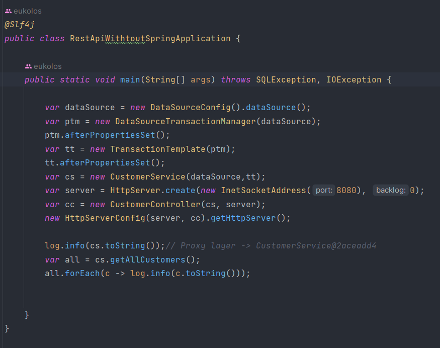
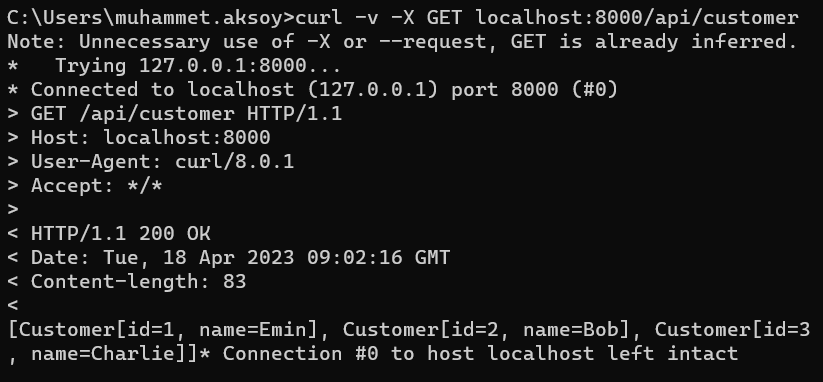
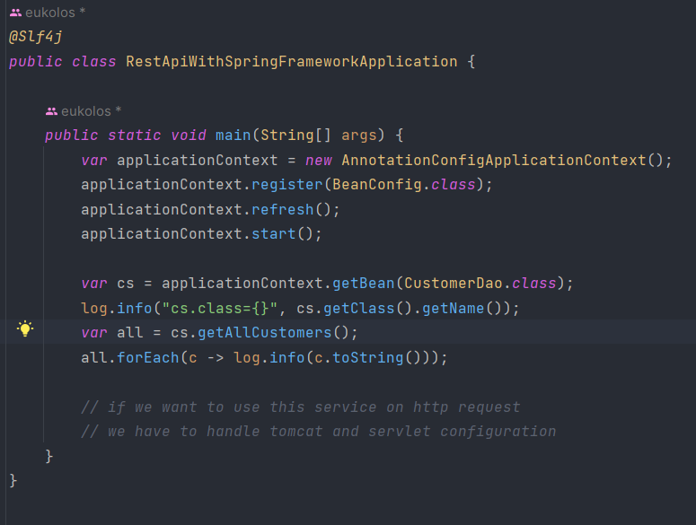
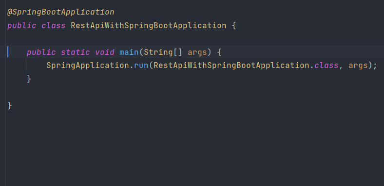

# Comparison of Java-only REST API, Spring Framework and Spring Boot
This repository showcases the differences between Java-only API, Spring Framework and Spring Boot. The repository contains three different services:

## Java-only REST API Service without Spring Framework: 
This service highlights the challenges of developing a REST API using only Java without utilizing the Spring Framework. It clearly demonstrates the effort and complexity required to develop a REST API without the comprehensive features and conveniences provided by Spring Framework.
* Creating instances in main method
* Handling transactions
* Executing SQL queries
* And more...

  
  
## Service Developed using Spring Framework: 
This service demonstrates how to develop a REST API using Spring Framework. As a Java-based framework, Spring Framework offers a wide range of features that enable fast and reliable application development. This service showcases the advantages and conveniences of using Spring Framework.

* Spring beans
* Handling transactions easily
* Provided technologies like JDBC, JPA, etc.

   
However, there are still a lot of configurations to do like bean configurations. Spring does handle a lot of the challenges in the pure Java approach, but it still requires a lot of work to setup.

## Service Developed using Spring Boot: 
This service showcases how to develop a REST API using Spring Boot. Spring Boot is making application development faster and easier. This service illustrates the benefits of Spring Boot, such as automatic configuration, quick start templates, and easy deployment.

* Auto configuration
* Starter dependencies
* And many more...

    
Spring Boot handles all the boilerplate configurations required in the pure Java and Spring approaches. You can focus on writing the business logic.

In summary, this repository demonstrates how writing enterprise applications become gradually easier from pure Java to Spring to Spring Boot due to the increasing level of abstraction.
This repository aims to assist developers in understanding the differences between Basic Java API, Spring Framework and Spring Boot. Each service is developed using a different approach, highlighting the advantages and conveniences provided by Basic Java API, Spring Framework and Spring Boot in a comparative manner. The code examples and documentation in this repository will help developers understand the strengths of Basic Java API, Spring Framework and Spring Boot.

## How to Run?

## Setup and Installation

To run this project, you will need to have Java 17.

#### Maven

<b>1 )</b> Download your project from this link shown below
```
    git clone https://github.com/Eukolos/painful-difficulty-to-effortless-ease.git
```

<b>2 )</b> Go to the projects' home directory shown below
```
    cd painful-difficulty-to-effortless-ease/rest-api-withtout-spring
    cd painful-difficulty-to-effortless-ease/rest-api-with-spring
    cd painful-difficulty-to-effortless-ease/rest-api-with-spring-boot
```

<b>3 )</b> Create native image though this command shown below
```
    mvn spring-boot:run
 ```   

Contributing
This repository is an open-source project and welcomes contributions from developers. Any bug fixes, feature additions, or improvements are appreciated. Please follow the standard GitHub fork and pull request workflow for contributing to this repository.
```
bash
Copy code
# Clone the repository
git clone https://github.com/eukolos/painful-difficulty-to-effortless-ease.git

# Create a new branch
git checkout -b my-feature-branch

# Make changes and commit
git add .
git commit -m "Add new feature"

# Push changes to your forked repository
git push origin my-feature-branch

# Create a pull request on GitHub from your forked repository
Please make sure to adhere to the code of conduct and contribute in a respectful and collaborative manner. Thank you for your contributions!```